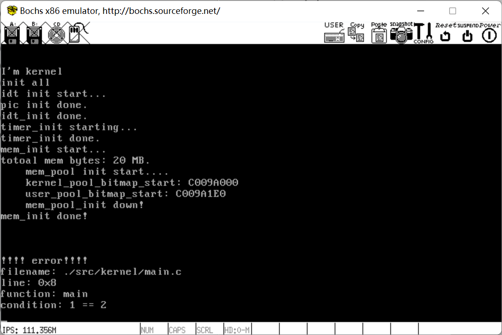

# 用于学习的操作系统入门
### 简介
本项目致力于学习操作系统基本框架，涉及计算机加电后的启动流程，内存管理，线程管理和外设管理。部分参考《操作系统真象还原》。目前完成boot引导部分。

### 使用方法
执行如下命令进行编译
```shell
mkdir build
./build.sh
```
启动和调试请执行：
```
bochs -f bochsrc.disk
```

### 运行状态


### Contact
有疑问请发邮件：328825619@qq.com